# Hyde Salesforce KT Summary

## Overview
This document consolidates KT sessions from:
- 30-Mar-2026
- 01-Apr-2026
- 08-Apr-2026
- 10-Apr-2026

Sources: Knowledge Sharing sessions. References: turn1search2, turn1search1, turn1search3, turn2search1.

---

# 1. Hyde Salesforce Architecture

## Core Platforms
- Salesforce Sales Cloud
- Service Cloud
- Marketing Cloud
- Experience Cloud (My Account Portal)
- Northgate (NEC) Legacy Housing CRM
- Total Mobile (Repairs)
- AllPay (Payments)
- DIPA Integration Platform

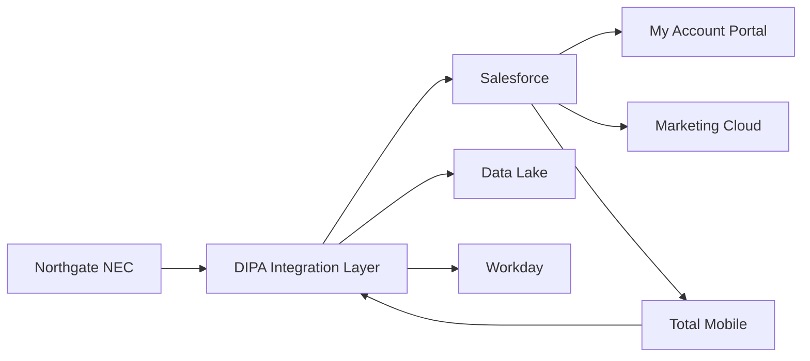

---

# 2. Core Salesforce Data Model

## Person Account Centric Model

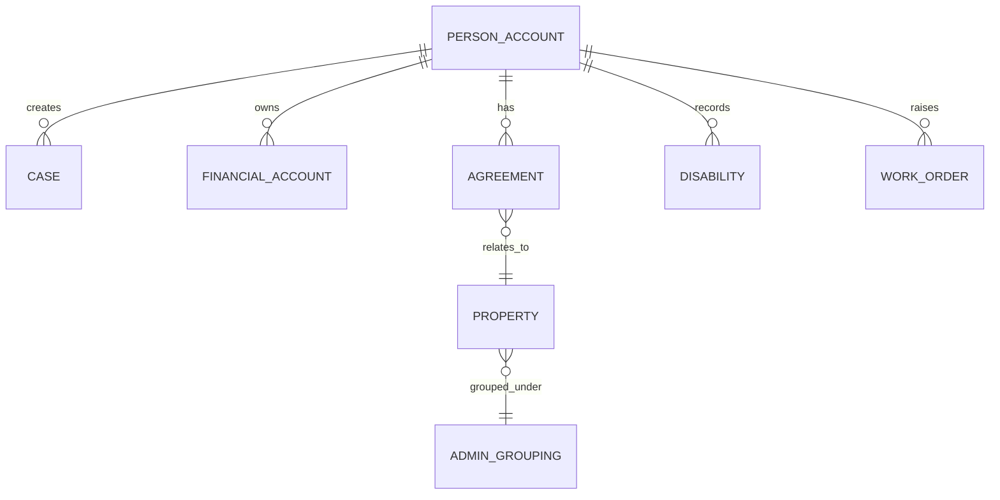

### Key Objects
- Person Account (Customer/Tenant)
- Occupancy Agreement
- Property
- Administrative Grouping
- Financial Account
- Cases
- Work Orders
- Disabilities & Vulnerabilities
- Person Notes

---

# 3. Customer Journey

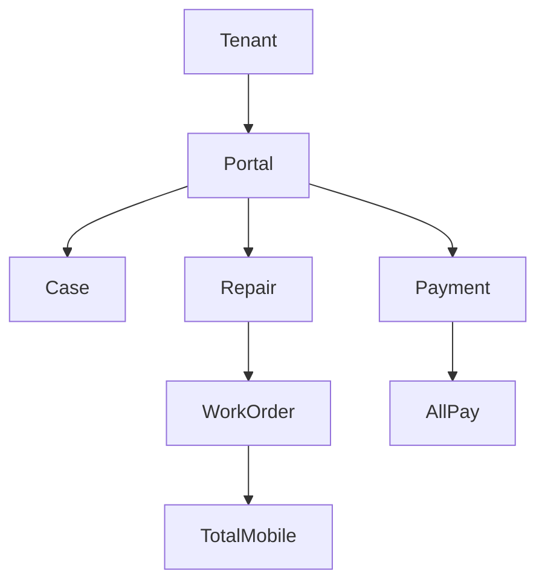

---

# 4. Northgate and Salesforce Relationship

## Current State

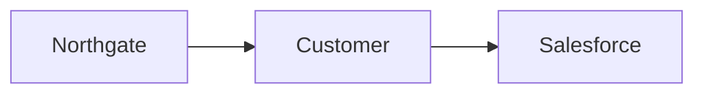

### Important Notes
- Customers are initially created in Northgate.
- Salesforce receives customer data via DIPA.
- Salesforce aims to become the future customer master system.
- Tenancy remains tightly coupled with Northgate.

## Target Future State

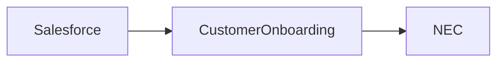

---

# 5. Testing Framework (Story 1542)

## Business Problem
QA automation requires dynamic customer segmentation.

### Old Approach
```text
IsTHCH = True/False
```

### New Approach
```text
Belongs To
- THCH
- Clove
- River
- Others
```

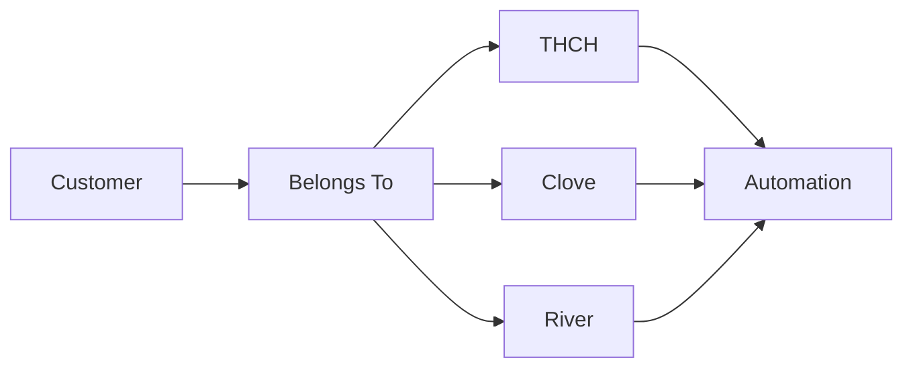

Benefits:
- Dynamic queries
- Real production-like data
- Better automated testing

---

# 6. Security Monitoring (Story 1541)

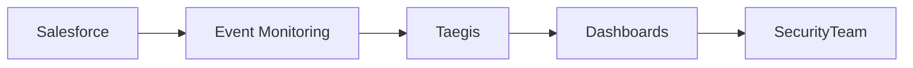

Purpose:
- Monitor session hijacking.
- Detect suspicious behaviour.
- Enable future automated security controls.

---

# 7. Connected Apps & Integrations

Preferred authentication pattern:

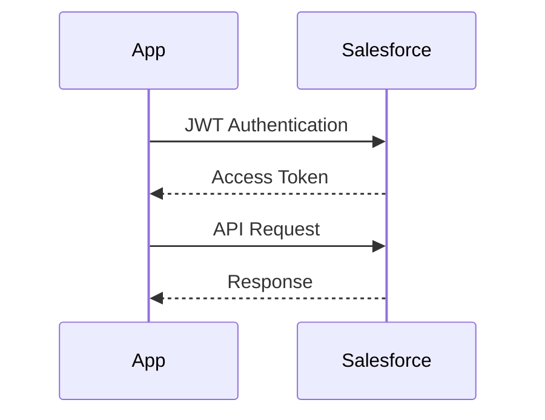

---

# 8. AllPay Payment Integration

## Payment Flow

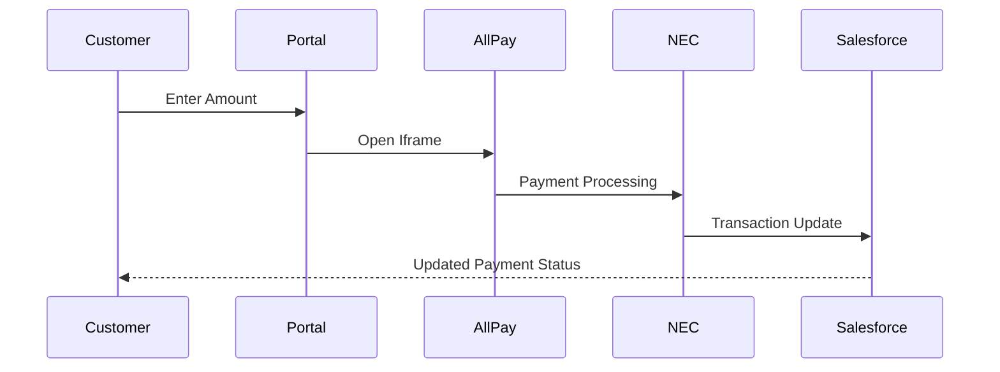

## Key Issues Solved

### iOS Issue
- Fixed by adding AllPay domains to Mobile Publisher allowed sites.

### Payment Status Issue
- AllPay was not consistently sending success/failure/cancel states.
- Alignment undertaken with AllPay team.

---

# 9. Marketing Cloud Integration

## Sources of Case Creation

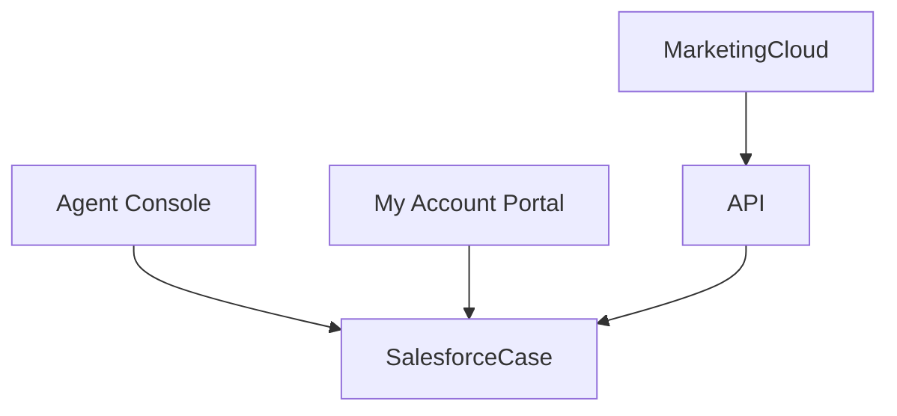

Supported use cases:
- Name Change
- Citizenship Change
- Disability Update
- Vulnerability Update

---

# 10. Sandbox Strategy & CI/CD

## Environment Flow

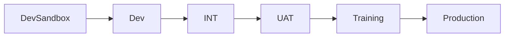

### Release Process

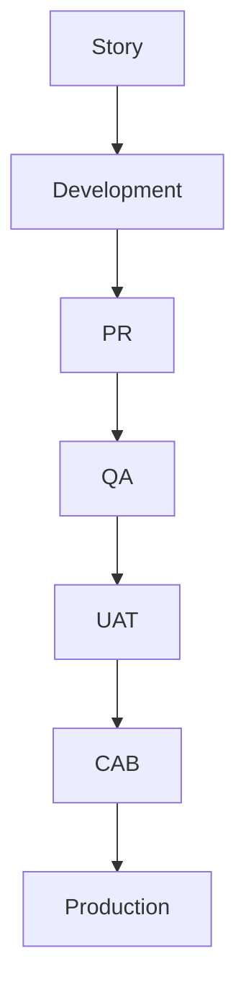

Key Notes:
- Deployments every two weeks.
- CAB approval required.
- Hotfixes supported.

---

# 11. Sandbox Refresh Programme

Goals:
- Branch synchronization.
- Metadata cleanup.
- Data anonymisation.
- Reduction of manual deployment steps.

## Data Anonymisation

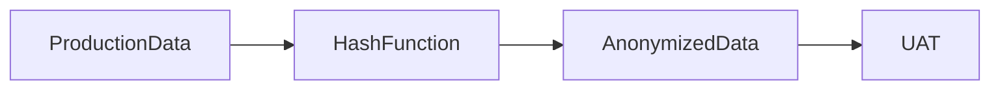

Masked fields:
- Email
- Phone
- Mobile

---

# 12. Customer Organisation (B2B) POC

## Current Model

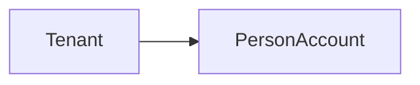

## Proposed B2B Model

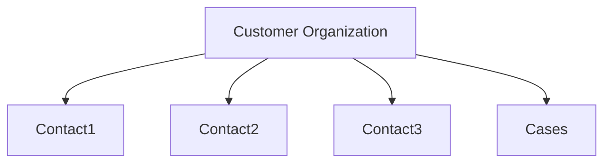

### Why It Was Built
- Some customers are organisations rather than tenants.
- Person Accounts are not suitable.
- Standard Account + Contact model required.

### Why It Was Put On Hold
- Source data in NEC is not truly B2B.
- Requires large-scale data cleanup.

### Changes Implemented
- New Customer Organisation record type.
- New layouts.
- New FlexiPages.
- Flow modifications.
- Portal logic exclusions.

---

# 13. Data Team & DIPA

## Ownership
- Led by Satya.
- Responsible for integration platform.

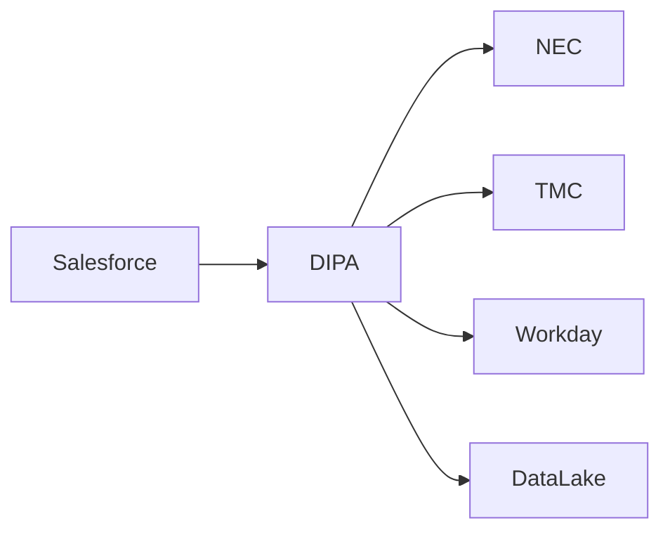

The Data Team is one of the most important teams the Salesforce developers interact with.

---

# 14. Key Things To Learn First

## Priority 1
- Person Accounts
- Properties
- Occupancy Agreements
- Financial Accounts
- Administrative Groupings

## Priority 2
- Case Management
- Repairs
- Work Orders
- Customer 360

## Priority 3
- DIPA
- Northgate Integration
- Total Mobile
- AllPay

## Priority 4
- Git Strategy
- Deployments
- CAB Process
- Sandbox Refresh

## Priority 5
- Marketing Cloud
- Connected Apps
- JWT
- Event Monitoring

---

# Executive Summary

Hyde's Salesforce platform is a housing-focused CRM built around Person Accounts and deeply integrated with Northgate (housing management), DIPA (integration middleware), Total Mobile (repairs), AllPay (payments), Marketing Cloud (customer engagement), and Experience Cloud portals. The strategic direction is to move customer mastery into Salesforce while retaining tenancy operations within Northgate until future transformation programmes are completed.
